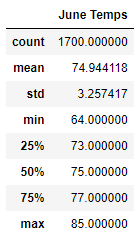
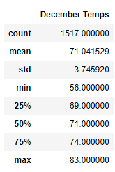

# surfs_up

## Overview of the analysis

The purpose of this analysis is to do an evaluation on the weather records W. Avy has of Oahu, in order to present the data to other possible investors, and to ensure the project won’t be affected negatively because of unfavorable weather.

## Results
  
  
  
  
•	Summer in Oahu consists of good temperatures that will promote the business and we know this by observing the June Temps table that was created, were the minimum temperature that can be reached is 64 F.

•	On the other hand, looking at the December Temps table we can see that because of winter the temperatures are lower than June, reaching minimum temperatures of 56 F.

•	However, the difference between temperatures in winter and summer are not very significant.

## Summary

Based on the temperature analysis of the Oahu island, I conclude that there is not a considerable variation on the temperatures among summer and winter, therefore it should not negatively affect the business.
